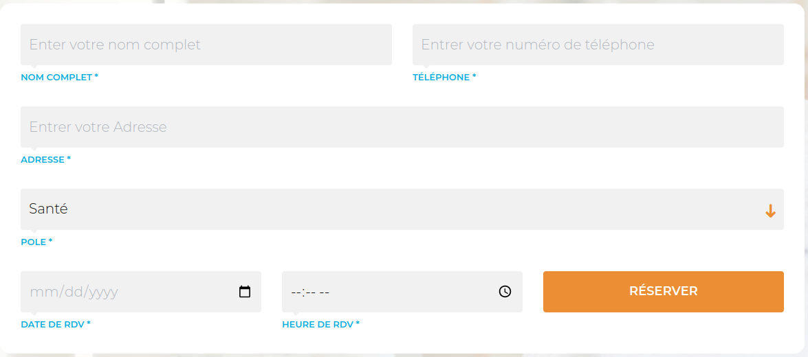

## Requirements

-   PHP >= 8.1 (or higher)
-   Composer
-   MySQL

## Installation

1.  Clone the repository
2.  Run `composer install`

3.  Create a database and update the `.env` file
4.  Run `php artisan migrate --seed`
5.  run `php artisan key:generate`
6.  Run `php artisan serve`

## License

The Laravel framework is open-sourced software licensed under the [MIT license](https://opensource.org/licenses/MIT).

## Credits

-   [Laravel](https://laravel.com/)

## Screenshots : 

| Form |
| --- |
|  |

## Contact

-   [Twitter](https://twitter.com/devscriptt)
-   [LinkedIn](https://www.linkedin.com/in/devscript)
-   [GitHub](https://www.github.com/elmarzouguidev)

## Donate

If you like this project, leave a star and share it with your friends.

## Contributors

| Contributor | GitHub Profile |
| --- | --- |

| [elmarzouguidev](https://github.com/elmarzouguidev) |  |
